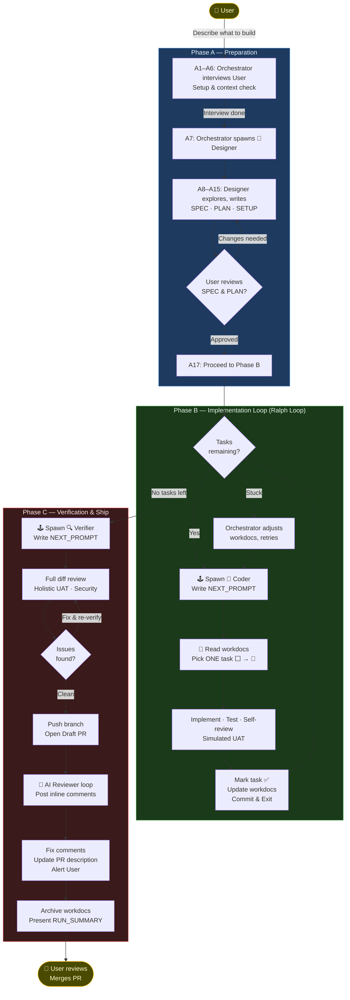

# Ralph — Agentic Coding Workflow

Ralph is an unsupervised agentic coding workflow built for Claude Code. It orchestrates multiple short, focused agent sessions — each with fresh context — connected by **workdocs** as external memory and a **handoff file** (`NEXT_PROMPT<X>.md`) between them. Inspired by the [Ralph Wiggum Loop](https://ghuntley.com/specs/) (Geoffrey Huntley, 2025).

Two core principles:
- **Avoid context rot** through deliberate session management
- **Prevent error propagation** through agent self-verification and back pressure

---

## Workflow

---

## Roles

| Emoji | Role | Responsibility |
|-------|------|----------------|
| 👑 | **User** | Approves design, reviews PR, merges |
| 🕹️ | **Orchestrator** | Manages end-to-end workflow; spawns agents; owns loop control |
| 🎨 | **Designer** | Explores codebase, writes SPEC / PLAN / SETUP |
| 🔨 | **Coder** | Implements one task per session; self-verifies; exits |
| 🔍 | **Verifier** | Holistic verification; opens and iterates on the PR |

---

## Workdocs (External Memory)

Each fresh agent session re-reads these files from scratch — no reliance on context compaction.

| File | Purpose |
|------|---------|
| `USER_PROMPT.md` | Original user request, verbatim. Write-once. |
| `SPEC.md` | Full spec: requirements, architecture, verifiable success criteria |
| `PLAN.md` | Task list with `⬜ / 🔧 / ✅` status markers |
| `SETUP.md` | Project-specific tooling, env vars, test fixtures |
| `TAKEAWAYS.md` | Learnings, deviations, workflow observations |
| `NEXT_PROMPT<X>.md` | Handoff file written before each spawned agent |

---

## Key Variables

| Variable | Default | Description |
|----------|---------|-------------|
| `designer_model` | `claude-opus-4-6` | Model for the designer agent |
| `coder_model` | `claude-sonnet-4-6` | Model for each coder agent |
| `verifier_model` | `claude-opus-4-6` | Model for the verifier agent |
| `max_fix_iterations` | `10` | Max fix/re-verify cycles before escalating |
| `max_stuck_retries` | `3` | Max retries when an agent makes no progress |
| `ai_reviewer_max_iterations` | `5` | Max AI reviewer feedback cycles in Phase C |

---

## Usage

Install via [Claude Code](https://claude.ai/code) and point to this repo's `skills/` directory. Then, in any session:

> "Build [feature] using the ralph workflow."

The orchestrator agent handles everything from there — interviewing you during Phase A, running the implementation loop autonomously in Phase B, and alerting you when the PR is ready for review in Phase C.

---

## Philosophy

> Context rot is the enemy of reliable agentic systems. The Ralph loop exits deliberately, hands off via structured workdocs, and starts fresh — every single time.

See [`skills/ralph-workflow/SKILL.md`](skills/ralph-workflow/SKILL.md) for the full specification.
